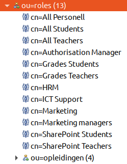
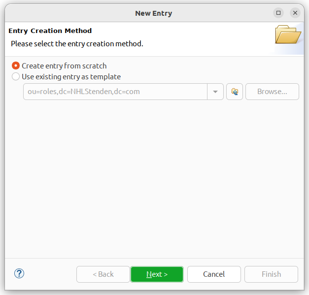
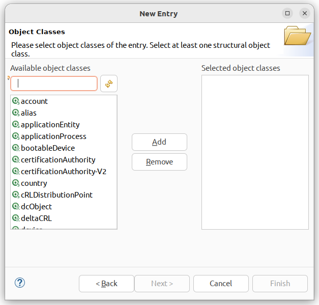
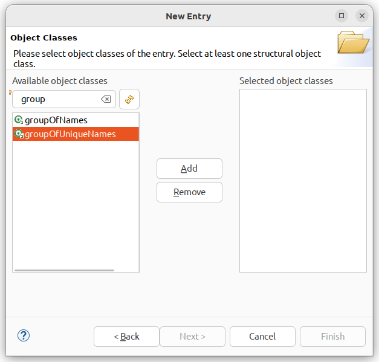
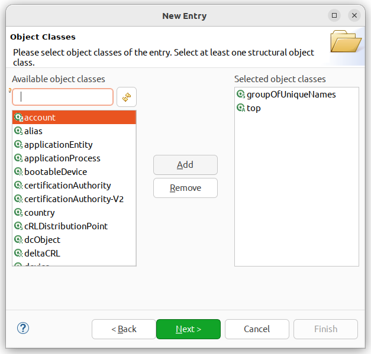
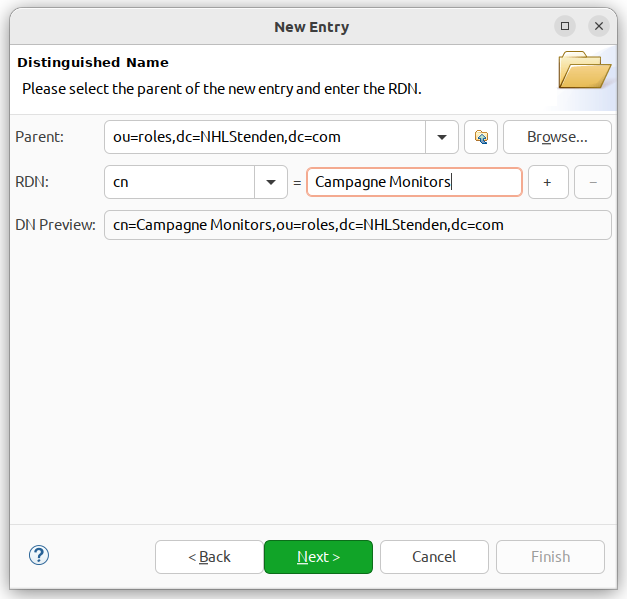
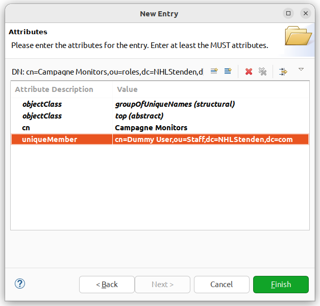
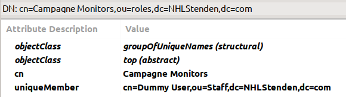
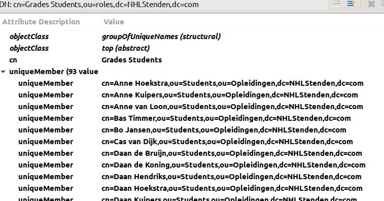

# Instructie voor het aanmaken van een nieuwe LDAP GroupOfUniqueNames

Voor opdracht 9 is het nodig dat je een nieuwe rol maakt in de LDAP administratie. Een rol wordt in de LDAP
administratie vastgelegd in de vorm van een `GroupOfUniqueNames`. In deze instructie lees je hoe je dat moet doen.

## De juiste locatie

Navigeer in je LDAP-administratie naar de *DistinguishedName* `ou=roles,dc=NHLStenden,dc=com`.

Je ziet hier al meerdere rollen bestaan.

## Aanmaken nieuwe entry

1. Selecteer de locatie `ou=roles,dc=NHLStenden,dc=com` zoals in bovenstaande afbeelding.
2. Kies in het menu `LDAP` en dan `New entry`.
3. Er opent zicht een dialoogvenster dat we stap voor stap gaan invullen.

Zorg dat in de eerste stap de radiobutton `Create entry from scratch` staat.

Druk op `Next` om naar de volgende stap te gaan. Hier kiezen we wat voor soort object we willen maken.

Type in het vakje `Available object classes` de tekst `GroupOfUniqueNames` (of een deel daarvan).

Druk daarna op de knop `Add` zodat deze toegevoegd wordt aan de rechterlijst. Zie onderstaande afbeelding.

Druk op `Next` om naar de volgende stap te gaan. Nu moeten we het object een naam geven. Nu is het zo dat in LDAP
er altijd een sleutel + waarde gebruikt wordt. Bijvoorbeeld 'Achternaam' met 'Molema'. Dat geldt ook voor de naam
van het object. Je mag zelf kiezen welke je wilt gebruiken. In dit geval kiezen we voor `CN` als sleutel en de waarde
wordt `Campagne Monitors`.

Als het goed is, dan is de `DN Preview` dus de waarde `cn=Campagne Monitors,ou=roles,dc=NHLStenden,dc=com`.

Druk weer op `Next` om verder te gaan naar de volgende stap. We kunnen andere waarden instellen. Officieel is de waarde
`uniqueMember` verplicht en mag niet leeg zijn. Voeg daarom een dummy gebruiker toe. Deze is al aanwezig en heeft
de volgende DistinguishedName die je zo kunt kopiëren en plakken.

> `cn=Dummy User,ou=Staff,dc=NHLStenden,dc=com`

Na het opslaan met `Finish` zou je onderstaande moeten zien.

# Meer informatie over Multi-Value entries

In LDAP kun je één sleutel hebben die meerdere waarden mag hebben. Dat is wat anders dan een attribuut dat meerdere
keren
kan voorkomen.

De `GroupOfUniqueNames` is zo'n attribuut: je kunt hier meerdere gebruikers in opslaan. Kijk maar eens naar de
`DN: cn=Grades Students,ou=roles,dc=NHLStenden,dc=com`. Als je deze selecteert krijg je onderstaande afbeelding.

Je herkent `Multi Value Attributes` aan het driehoekje voor het attribuut. Je kunt hier op klikken om de lijst open
te klappen en de lijst met waarden te bekijken.

Je ziet echter ook het attribuut `ObjectClass`. Deze komt meerdere keren voor om de bovenliggende klassen van een
object weer te geven. Dit is dus fundamenteel een andere manier van attributen gebruiken.

# Meer informatie over naamgeving in LDAP

In LDAP zijn er **geen harde, verplichte conventies** voor welke attributen je moet gebruiken als **Relative
Distinguished Name (RDN)** voor een object, zelfs niet afhankelijk van de objectClass. Maar er zijn wél gangbare **best
practices** en **aanbevelingen**, en sommige LDAP-servers (zoals Active Directory) hanteren die min of meer als norm.

Hier is een overzicht van wat vaak wordt gebruikt per objectClass:

| objectClass                | Veelgebruikt RDN-attribuut | Opmerking                                                               |
|----------------------------|----------------------------|-------------------------------------------------------------------------|
| `organizationalUnit`       | `ou`                       | Veel gebruikt voor organisatorische eenheden                            |
| `organization`             | `o`                        | Gebruikelijk, maar niet verplicht                                       |
| `person` / `inetOrgPerson` | `cn`                       | Common Name is gangbaar voor personen                                   |
| `groupOfNames`             | `cn`                       | Ook hier is `cn` gangbaar, maar `ou` komt ook voor                      |
| `domain`                   | `dc`                       | Verplicht in de context van DIT-structuren op basis van domainComponent |
| `device`                   | `cn` of `uid`              | Afhankelijk van implementatie                                           |
| `user` (AD-specifiek)      | `cn`                       | AD gebruikt `cn` standaard voor gebruikers                              |

### Belangrijke punten:

- **De RDN hoeft niet uniek te zijn in de hele directory**, maar wél binnen de directe container (bijv.
  `ou=People,dc=example,dc=com`).
- **Het attribuut dat je kiest als RDN moet wel bestaan in het object** — als je bijvoorbeeld `uid=jsmith` gebruikt als
  RDN, moet het attribuut `uid` in de entry zelf aanwezig zijn.
- **LDAP-servers zoals Active Directory zijn minder flexibel**: ze verwachten vaak specifieke RDN-attributen, zoals `cn`
  voor gebruikers en groepen.
