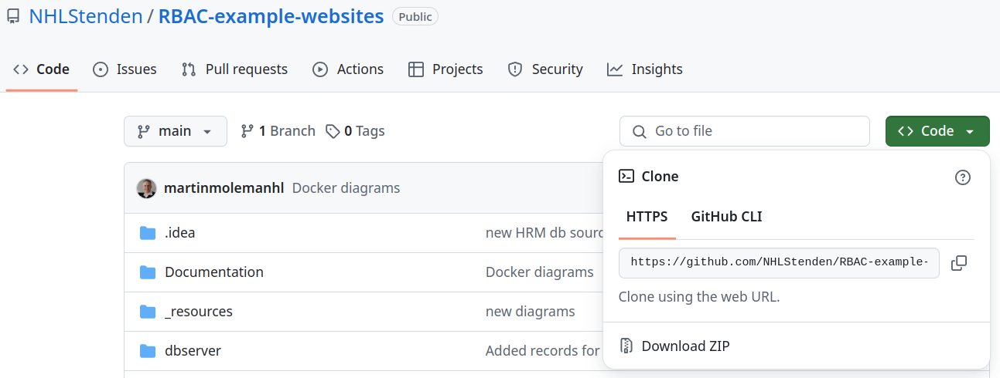
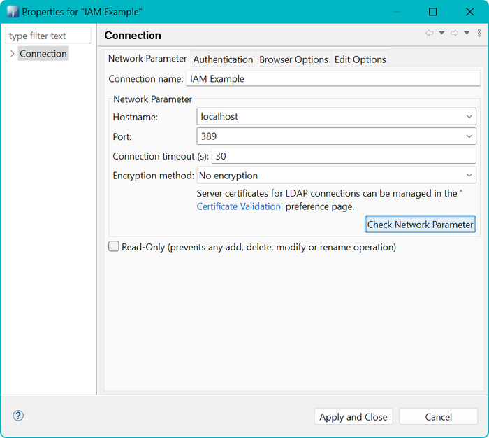
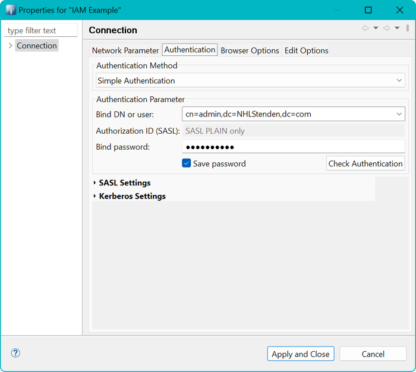
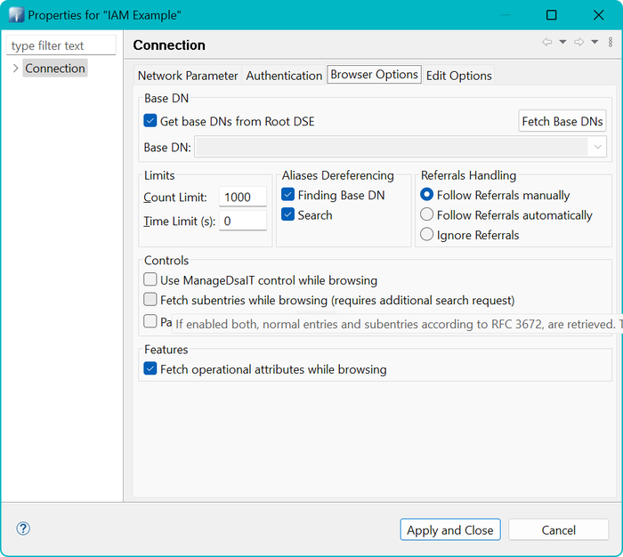
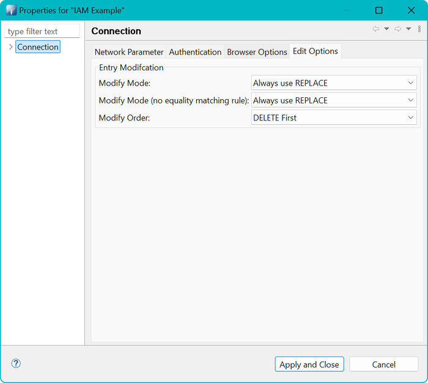
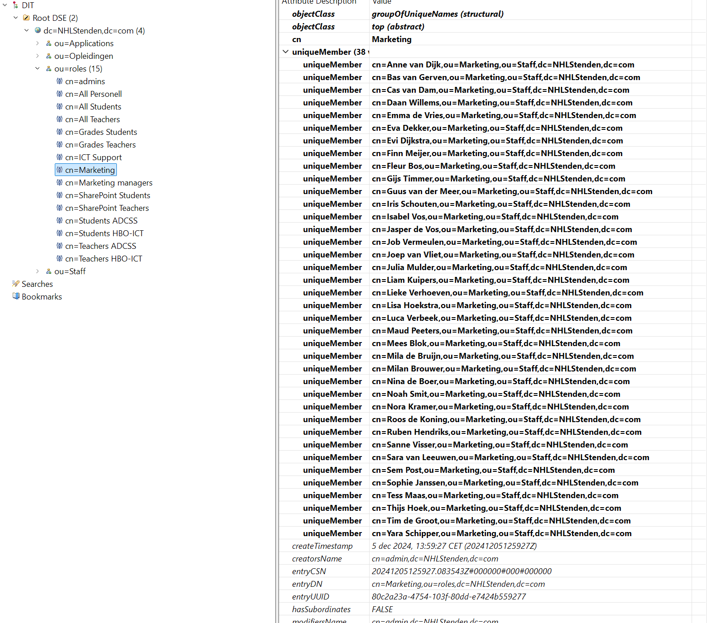
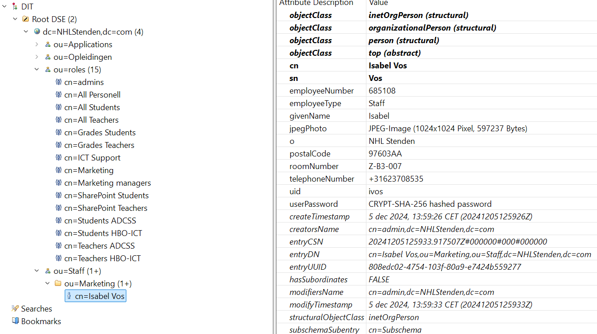

# Installatiehandleiding

Welkom bij de repository voor de oefeningen rondom het thema Identity & Access Management (IAM). In deze handleiding
wordt uitgelegd hoe je de Docker Containers aan de praat kunt krijgen. Onderaan deze handleiding vind je veel
verwijzingen naar websites (**Referenties**), een verantwoording van het tot stand komen van de gegevens en afbeeldingen
en tips hoe je wél een veilige website kunt (laten) bouwen.

# Architectuur

De architectuur leunt op het concept van containerisation: het onderbrengen van functionaliteit in kleine afgebakende
eenheden die we "containers" noemen. Het Engelse werkwoord "to contain" betekent iets binnen grenzen houden of
omsluiten, zoals een doos die voorwerpen bevat. In de context van Docker verwijst het naar het afzonderen van een
applicatie met al haar afhankelijkheden in een geïsoleerde omgeving.

Hieronder volgt een diagram met toelichting op de gekozen indeling en taakverdeling.


Meer informatie over de verantwoording vind je in dit [document](../Documentation/Verantwoording.md).

# Installatie en activeren

Hier wordt uitgelegd hoe je deze repository kunt installeren en de software kunt starten om de oefeningen uit te voeren.

## Randvoorwaarden

Om deze oefeningen uit te kunnen voeren heb je de volgende zaken nodig:

* Een werkende Docker installatie
* Toegang tot je `hosts`-file voor het toevoegen van hostnames.
* De applicatie Apache Directory Studio

Om aan de slag te gaan doorlopen we de volgende stappen. Deze worden verderop verder toegelicht.

1. Download deze repository als een ZIP file.
2. Als je deze repository op je computer hebt staan ga je naar de map en open je een Command Prompt (bash, cmd,
   Powershell)
3. Bouw en start de container
4. Voeg in je hosts-file de URL's van de website toe

## Ophalen repository

Als je deze repository wilt downloaden gebruik dan de download optie van GitHub. Deze vind je op boven de lijst met
bestanden via de groene knop `code`. Zie de afbeelding hier onder. Door op de groene knop te drukken wordt een
popup geopend met onderin de optie 'Download ZIP'. Druk op deze knop en er zal een download starten.



## Controle bestanden

Mocht je gebruik maken van `git clone` om de bestanden op te halen, dan zijn er op Windows enkele correcties die je
moet uitvoeren! Zo niet lees dan verder bij de volgende [stap](#bouw-en-start-de-containers).

Let op: veel bestanden worden gebruikt binnen een Linux Docker omgeving (Debian). Tekstbestanden worden daar opgemaakt
met regelovergangen die alleen een Linefeed (ASCII code 10) `LF` gebruiken. Bij het ophalen en uitpakken van de
repository kan het zijn dat bestanden omgezet worden naar Windows opmaakt met een Carriage Return (ASCII code 13) en
LineFeed. Dit wordt ook wel de CRLF of CR+LF opmaak genoemd.

Als die bestanden tijdens het uitpakken omgezet zijn naar CR+LF, dan werken deze niet meer in Docker. Als het goed is
zou het bestand `.gitattributes` dit moeten voorkomen. Daar staat een instelling in dat bestanden altijd alleen LF
moeten bevatten voor de regelovergangen.

Fouten die voor kunnen komen zijn onder andere `exit code 127: file not found`.

Eventueel kan GIT ingesteld worden om dit globaal te negeren door onderstaande commando uit te voeren. Als je dat
commando
hebt uitgevoerd en je gebruikte `git clone` dan moet je deze nieuwe map weggooien en opnieuw `git clone` uitvoeren.

```text
git config --global core.autocrlf false
```

In de folder van deze repository staan ook twee programma's die de bestanden kunnen repareren

* Voor Windows: `convert-cr-lf.exe`
* Voor onder WSL: `convert-cr-lf-wsl`

Mocht het nodig zijn om deze programma's aan te passen of te hercompileren, kijk dan in de map
`_resources/support/convert-crlf` en het daar aanwezige [`README.md`](../_resources/support/convert-crlf/README.md)
bestand voor instructies.

## Bouw en start de containers

De eerste stap is het bouwen van de containers. Dat doe je met onderstaande commando:

```cmd
  docker compose build --no-cache
```

In de eerste stap worden de containers gebouwd. De optie `--no-cache` zorgt er voor dat je eerdere instanties/images
van je containers niet hergebruikt, maar echt helemaal opnieuw begint.

De tweede stap start daadwerkelijk de containers. De optie `-d` bij `docker compose up` zorgt er voor dat je in deze
command-prompt verder kunt werken omdat de dockers nu in de achtergrond draaien.

```cmd
  docker compose up -d
```

Als we dit grofweg samenvatten zou het er uiteindelijk zo uit moeten zien (er zijn delen weggelaten).

```cmd
c:\mijn\project\map\RBAC-example-websites> docker compose build --no-cache
....................
....................
[+] Building 5/5
 ✔ iam-example-db-server            Built                                                                                                                                                                                                                                                                      0.0s 
 ✔ iam-example-hrmdb-server         Built                                                                                                                                                                                                                                                                      0.0s 
 ✔ iam-example-identity-server      Built                                                                                                                                                                                                                                                                      0.0s 
 ✔ iam-example-provisioning-server  Built                                                                                                                                                                                                                                                                      0.0s 
 ✔ iam-example-webserver            Built 

c:\mijn\project\map\RBAC-example-websites> docker compose up -d
[+] Running 6/6
 ✔ Network rbac-example-websites_iam-example  Created                                                                                                                                                                                                                                                          0.1s 
 ✔ Container iam-example-identity-server      Started                                                                                                                                                                                                                                                          0.5s 
 ✔ Container iam-example-db-server            Started                                                                                                                                                                                                                                                          0.5s 
 ✔ Container iam-example-hrm-server           Started                                                                                                                                                                                                                                                          0.5s 
 ✔ Container userprovisioning                 Started                                                                                                                                                                                                                                                          0.5s 
 ✔ Container iam-example-webserver            Started
 
 c:\mijn\project\map\RBAC-example-websites>   
```

Als de containers eenmaal zijn gebouwd, kunnen ze ook eenvoudig beheerd worden via bijvoorbeeld een plug-in in je IDE of
via de Docker Desktop applicatie (niet beschikbaar op Linux).

## Aanmaken van accounts en vullen van de database

Nu de containers draaien moeten we de accounts aanmaken, rollen en permissies definiëren en het personeel in de
datababase laden. Hiervoor is een script beschikbaar in de container voor de Identity provider (LDAP).

Start het script om alle accounts en gerelateerde informatie te genereren. Dit doe je door een script dat in de
container zit te starten. We gebruiker het commando `docker exec` om commando's in een lopende container te kunnen
starten.

```cmd
  docker exec -it iam-example-identity-server /bin/bash -c /app/slapd-load-entries.sh
```

## Aanpassingen in de hosts file

We willen meerdere websites kunnen gebruiken, terwijl er maar één webserver actief is. Om de webserver te vertellen
welke website we willen benaderen moeten we steeds de goede URL gebruiken. Echter, we moeten ons Operating System (
Windows, Linux, Mac) wel een handje helpen om te bepalen welke URL's we gebruiken en waar die naar toe moeten leiden. We
gebruiken hiervoor de `hosts` file om het DNS-proces te ondersteunen. Voeg onderstaande items toe aan je `hosts` file.
Instructies per OS volgen verderop.

```text
# Docker RBAC Example
127.0.0.1	grades.rbac.docker sharepoint.rbac.docker admin.rbac.docker marketing.docker hrm.rbac.docker
```

### Windows

1. **Open Notepad als _administrator_**:
    - Zoek naar "Notepad" in het Startmenu.
    - Klik met de rechtermuisknop op Notepad en selecteer "Als administrator uitvoeren".

2. **Open het hosts-bestand**:
    - In Notepad, ga naar `Bestand` > `Openen`.
    - Navigeer naar `C:\Windows\System32\drivers\etc`.
    - Selecteer "Alle bestanden (\*.\*)" in het dropdown-menu rechtsonder.
    - Selecteer het bestand `hosts` en klik op `Openen`.

3. **Voeg de regels toe**:
    - Voeg de volgende regels aan het einde van het bestand toe:
      ```
      127.0.0.1    grades.rbac.docker sharepoint.rbac.docker admin.rbac.docker marketing.docker hrm.rbac.docker
      ```

4. **Sla het bestand op**:
    - Ga naar `Bestand` > `Opslaan`.

### macOS

1. **Open Terminal**:
    - Zoek naar "Terminal" in Spotlight (Cmd + Spatie) en open het.

2. **Open het hosts-bestand met `nano` of een andere terminal editor**:
    - Typ het volgende commando en druk op Enter:
      ```bash
      sudo nano /etc/hosts
      ```
    - Voer je wachtwoord in wanneer daarom wordt gevraagd.

3. **Voeg de regels toe**:
    - Voeg de volgende regels aan het einde van het bestand toe:
      ```
      127.0.0.1    grades.rbac.docker sharepoint.rbac.docker admin.rbac.docker marketing.docker hrm.rbac.docker
      ```

4. **Sla het bestand op en sluit nano**:
    - Druk op `Ctrl + O` om op te slaan, druk op Enter om te bevestigen.
    - Druk op `Ctrl + X` om nano af te sluiten.

### Linux

1. **Open Terminal**:
    - Open je terminaltoepassing.

2. **Open het hosts-bestand met nano**:
    - Typ het volgende commando en druk op Enter:
      ```bash
      sudo nano /etc/hosts
      ```
    - Voer je wachtwoord in wanneer daarom wordt gevraagd.

3. **Voeg de regels toe**:
    - Voeg de volgende regels aan het einde van het bestand toe:
      ```
      127.0.0.1    grades.rbac.docker sharepoint.rbac.docker admin.rbac.docker marketing.docker hrm.rbac.docker
      ```

4. **Sla het bestand op en sluit nano**:
    - Druk op `Ctrl + O` om op te slaan, druk op Enter om te bevestigen.
    - Druk op `Ctrl + X` om nano af te sluiten.


# Linux gebruikers opgelet!

Als je werkt op een Linux systeem dan moet er mogelijk een extra aanpassing gedaan worden voordat je kunt testen. Dat 
komt omdat de map met de websites verbonden wordt met een map in jouw eigen Linux host systeem! Het betreft de map

> volumes/src/websites

die wordt verbonden aan de map

> /var/www

in de Docker container. Zorg dat iedereen daar lees- en schrijfrechten heeft! Dus bijvoorbeeld door onderstaande 
commando uit te voeren in de Docker container óf op je host systeem

In de container

```bash
docker exec -it iam-example-webserver  chmod -R a+rwX /var/www
```
(Let op de hoofdletter X: dit zorgt dat de X-bit alleen op mappen wordt ingesteld en niet op bestanden.)

Of op je Linux Host:

```bash
chmod -R a+rwX /mijn/map/met/projecten/RBAC-example-websites/volumes/src/websites
```


# Testen van de websites

Nu de Docker Containers goed draaien is het tijd om een eerste test uit te voeren. Dit doen we door de websites te
openen in een browser die **BasicAuthentication** beschikbaar heeft. Let op: in Microsoft Edge kan het zijn dat een
policy
niet langer BasicAuthentication (`basic`) toestaat.

Zie https://answers.microsoft.com/en-us/microsoftedge/forum/all/latest-version-of-edge-no-longer-shows-basic/3601252b-e56b-46c0-a088-0f6084eabe47
en `edge://policy/` (zoek naar AuthSchemes) en check of `basic` daar bij staat. Zo niet, gebruik dan een andere browser
(Brave, Firefox, Chromium, Opera, Vivaldi of Google Chrome).

De volgende websites zijn beschikbaar:

| Beschrijving                                     | URL                       | Rol in Identity Server                                                                                           | 
|--------------------------------------------------|---------------------------|------------------------------------------------------------------------------------------------------------------| 
| De website voor Marketing:                       | http://marketing.docker/  | `cn=marketing,ou=roles,dc=NHLStenden,dc=com`                                                                     |
| De Cijfer Administratie                          | http://grades.rbac.docker/     | `cn=Grades Students,ou=roles,dc=NHLStenden,dc=com` of `cn=Grades Teachers,ou=roles,dc=NHLStenden,dc=com`         |
| Het Admin panel van de beheerder                 | http://admin.rbac.docker/      | `cn=ICT Support,ou=roles,dc=NHLStenden,dc=com`                                                                   |
| Het Human Resource Management systeem            | http://hrm.rbac.docker/        | `cn=hrm,ou=roles,dc=NHLStenden,dc=com`                                                                           |
| Het SharePoint platform voor gedeelde informatie | http://sharepoint.rbac.docker/ | `cn=SharePoint Students,ou=roles,dc=NHLStenden,dc=com` of `cn=SharePoint Teachers,ou=roles,dc=NHLStenden,dc=com` |

Je kunt hierbij inloggen met de volgende gebruikers. Het wachtwoord is altijd  `Test1234!`. Je kunt met Apache Directory
Studio (zie verderop) ook kijken in de aangegeven rollen in de Identity Server. De onderstaande gebruikersaccounts zijn
willekeurig gekozen uit die rollen.

* http://marketing.docker/
    * username : `fbos`
* http://grades.rbac.docker/
    * student username : `edeboer`
    * teacher username : `gwillems`
* http://admin.rbac.docker/
    * username: `tvisser`
* http://sharepoint.rbac.docker/
    * student username : `edeboer`
    * teacher username : `gwillems`
* http://hrm.rbac.docker
    * username: `kmulder`

# Verbinding maken met de Identity Server (LDAP)

1. Installeer Apache Directory Studio via deze [handleiding](./InstallApacheDirectoryStudio.md).
2. Maak verbinding met onderstaande informatie.

* Connection:
    * Hostname: `localhost`
    * Port: `389`
* Authenticatie
    * Authentication method: `Simple Authentication`
    * Gebruikersnaam / DN: `cn=admin,dc=NHLStenden,dc=com`
    * Wachtwoord: `test12345!`
* Opties:
    * Fetch Operational attributes is optioneel

Hieronder een aantal schermafdrukken over de instellingen voor *Apache Directory Studio*. Gebruik na het opstarten
van Apache Directory Studio het menu `LDAP --> New Connection` om een nieuwe verbinding op te zetten.



Gebruik de button `Check Network Parameter` om te kijken of de server op deze manier te bereiken is.



Gebruik de button `Check Authentication` om te kijken of de gebruikersnaam en wachtwoord correct zijn.





Gebruik daarna `Apply and Close`. Daarna zou in het linkervenster de boomstructuur van de identity server zichtbaar
moeten zijn. Mochten er nog geen items zichtbaar zijn onder `dc=NHLStenden,dc=com`, kijk dan terug bij de installatie en
activeren van de Docker Containers.


## Autorisaties bekijken

Autorisaties zijn vormgegeven door gebruikers in groepen te verzamelen. Dit zijn LDAP-objecten
genaamd `groupOfUniqueNames`. Een voorbeeld is hier onder weergegeven.



We zien hier een groep met naam `Marketing` (CN=Marketing). Het totale pad (`Distinguished Name` of `DN`) is
`cn=Marketing,ou=roles,dc=NHLStenden,dc=com`.

Aan de rechtkant zien we de details. Daar is een veld `uniqueMember` dat opengeklapt kan worden. Daar zijn 38 leden te
zien.

Om de details van een gebruiker te zien kan een gebruiker geselecteerd worden en op de `F3`-toets te drukken. Het is ook
mogelijk zelf de `DN` af te lezen en daar handmatig naar toe te navigeren.

Als we bijvoorbeeld navigeren naar gebruiker naar Isabel Vos, dan krijgen we onderstaande details.



# Verantwoording testgegevens

In deze repository zijn grote hoeveelheden gebruikers opgenomen om te kunnen testen. De reden voor deze grote aantallen
is om ook beter de attestation te kunnen demonstreren.

De grote aantallen gebruikers zijn tot stand gekomen door middel van generatieve AI (Chat GPT). Daardoor is geen grip op
de kwaliteit van de namen. Zo zijn er vooral nederlandstalige namen gekozen en is er bijvoorbeeld geen rekening gehouden
met demografische spreiding op geslacht etc.

# A word on security and quality

Deze website is gebouwd met het oog op het kunnen oefenen met IAM en RBAC principes. Daarbij zijn concessies gedaan aan
de kwaliteit van de broncode en de algemene cyber security. Er zijn een aantal basismaatregelen getroffen zoals het
werken met *prepared statements* en *geparametriseerde queries* in SQL-expressies, het converteren van input naar echte
getallen als dat kan. Er zijn echter zaken ook niet geregeld.

De volgende items zijn inmiddels doorgevoerd:

* Er is voor elke website een Content Security Policy (CSP) gedefinieerd.
* Er is een penetratie test uitgevoerd met de **Zed Attack Proxy** (ZAP).
* Hoewel er weinig door gebruikers ingevoerde data gebruikt wordt, wordt er hier en daar *Input Sanitizing* gebruikt
* Er worden headers meegestuurd die de browser instrueren om bijvoorbeeld plaatsing in een iFrame te voorkomen
  of Cross-Site (XSS) Scripting te voorkomen

Wat nog beter kan:

* Er wordt in de formulieren geen gebruik gemaakt van CSRF-tokens. Een CSRF-token (Cross-Site Request Forgery-token) is
  een unieke, geheimgehouden waarde die wordt gegenereerd door een server en toegevoegd aan formulieren om te verifiëren
  dat de verzoeken afkomstig zijn van de geauthenticeerde gebruiker. Dit voorkomt dat kwaadwillende websites
  ongeautoriseerde acties uitvoeren namens de gebruiker.

Voor een goed inzicht hoe je een nog veiligere websites maakt, verwijs ik je naar bijvoorbeeld OWASP en het NSCS.

# Cleanup

Het User Provisioning proces in de container `userprovisioning` (of `iam-example-provisioning-server`) draait elke 3
minuten een achtergrond proces (`/app/run-sync.sh`) en deze genereert dan ook voor elke run een logfile. Deze kun je
eventueel opschonen met onderstaande commando. Let op: deze gooit ze *allemaal*  in één keer weg.

```bash
docker exec -it userprovisioning /bin/bash -c "rm /app/logs/*"
```

# Structuur van deze repository

```text
.
├── convert-cr-lf-win.exe
├── convert-cr-lf-wsl
├── dbserver **Configuration files for the IAM database server, including Docker**
│   ├── CreateDatabase-and-seed.sql
│   └── Dockerfile
├── docker-compose.yml
├── Documentation
│   └── **Documentation**
├── excersises.MD
├── hrm  **Configuration files for the HRM database server, including Docker**
│   ├── CreateDatabase-and-seed.sql
│   └── Dockerfile
├── identity-server  **Configuration files for the identity server, including Docker**
│   ├── add-more-info.py
│   ├── avatars
│   │   └── **Avatar afbeeldingen voor scripts **
│   ├── configure_ldap.sh
│   ├── Dockerfile
│   ├── generate_unique_dn_from_users.sh
│   ├── import_once_from_ldap_to_db.py
│   ├── ldif
│   │   └── **LDIF files to prepare base structures**
│   ├── ldif-base
│   │   └── **Base files for LDIF lists uploads**
│   ├── slapd-load-entries.sh
│   └── upload_avatars.py
├── images
│   ├── **Images for Readme, excersises**
├── provisioning
│   ├── crontab
│   ├── Dockerfile
│   ├── requirements.txt
│   └── src
│       ├── run-sync.sh
│       └── sync.py
├── README.md
├── _resources **All kinds of resources**
├── solutions.MD
├── test
├── tree.txt
├── User Provisioning.MD
├── Verantwoording.md
├── volumes
│   ├── hrm-data
│   │   └── **Databestanden van de HRM database**
│   ├── ldap-data
│   ├── mariadb-data
│   │   └── **Databestanden van de IAM database**
│   └── src
│       ├── dbserver
│       ├── hrm
│       ├── user-provisioning
│       │   └── **Logfiles van het User Provisioning proces**
│       └── websites
│           ├── admin **The source files for the Admin website**
│           ├── grades **The source files for the Grades ('Cijferadministratie') website**
│           ├── hrm **The source files for the HRM website**
│           ├── marketing **The source files for the Marketing website**
│           ├── shared **Shared source files for the multiple website**
│           └── sharepoint **The source files for the HRM website**
└── webserver **Configuration files for the webserver, including Docker config**
    ├── conf
    │   ├── admin.conf
    │   ├── grades.conf
    │   ├── hrm.conf
    │   ├── marketing.conf
    │   └── sharepoint.conf
    ├── Dockerfile
    └── ini
        ├── php.ini
        └── xdebug.ini

80 directories, 820 files

```

# Referenties / bronnen

* [Apache Directory Studio](https://directory.apache.org/studio/)
* [Docker Install](https://docs.docker.com/engine/install/)
* [NCSC ICT-beveiligingsrichtlijnen voor webapplicaties](https://www.ncsc.nl/documenten/publicaties/2019/mei/01/ict-beveiligingsrichtlijnen-voor-webapplicaties)
    * **Nationaal Cyber Security Centrum**. Als expert werken wij aan een digitaal veilig Nederland. De digitale
      infrastructuur is van levensbelang: voor het betalingsverkeer, schoon water uit de kraan en om de voeten droog te
      houden.
* [OWASP](https://owasp.org/)
    * The Open Worldwide Application Security Project (**OWASP**) is a nonprofit foundation that works to improve the
      security of software
* [Zed Attack Proxy](https://www.zaproxy.org/)

# Colofon

Martin Molema, ing MSc

Docent bij NHL Stenden, opleidingen Bachelor HBO-ICT en Associate Degree Cyber Safety & Security.

[martin.molema@nhlstenden.com](mailto:martin.molema@nhlstenden.com)

5 april 2025