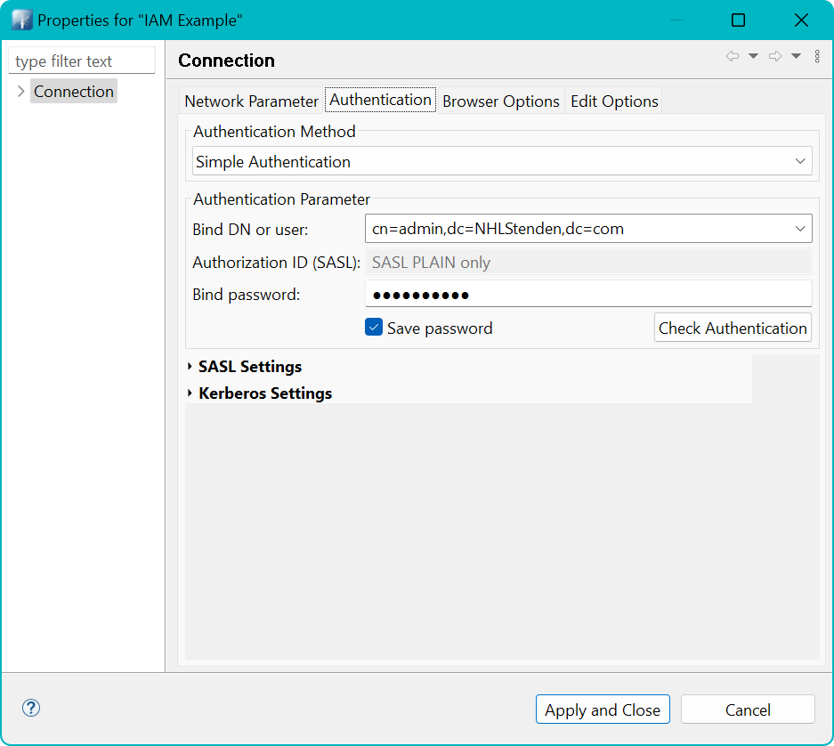
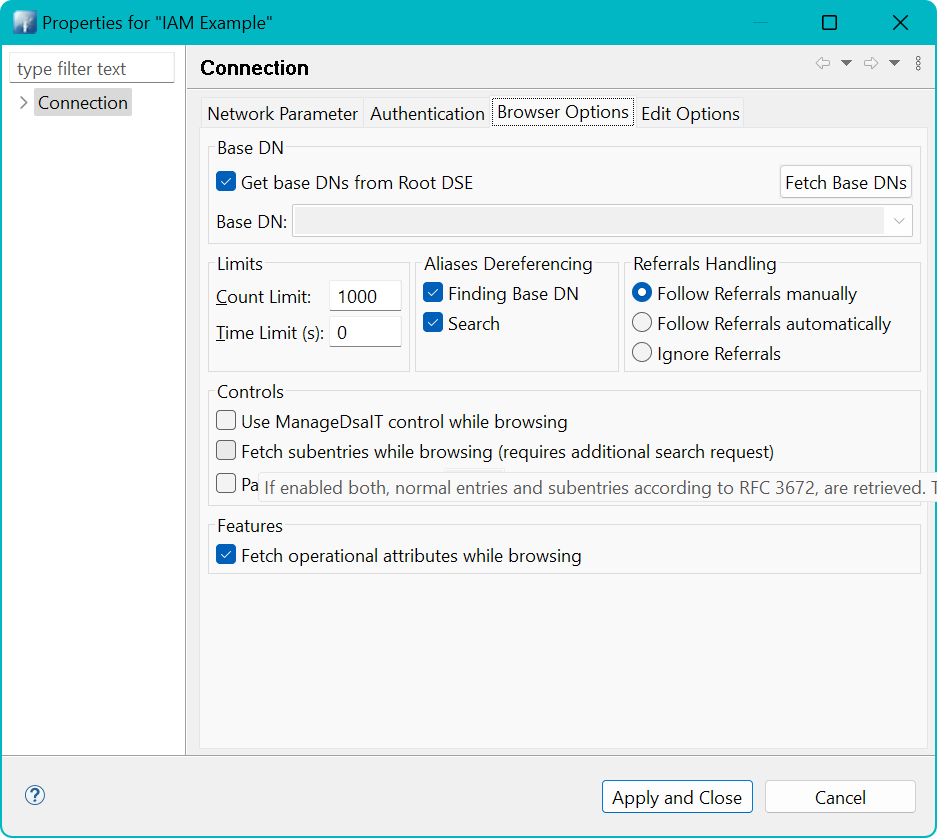
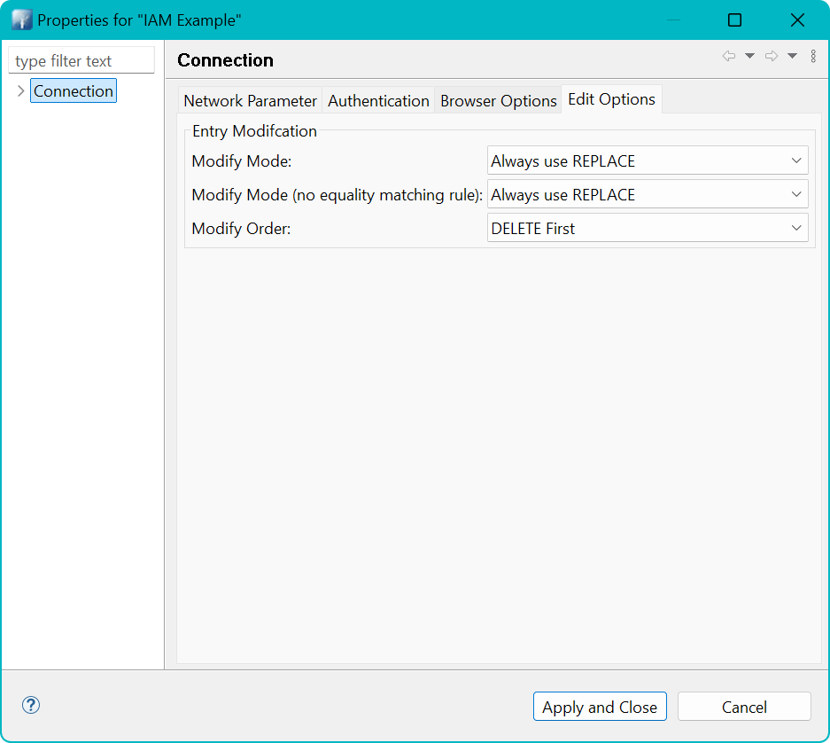
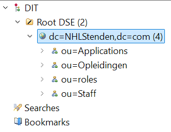

# Welkom

Welkom bij de repository voor de oefeningen rondom het thema Identity & Access Management (IAM). In deze handleiding
wordt uitgelegd hoe je de Docker Containers aan de praat kunt krijgen. Onderaan deze handleiding vind je veel
verwijzingen naar websites (**Referenties**), een verantwoording van het tot stand komen van de gegevens en afbeeldingen
en tips hoe je wél een veilige website kunt (laten) bouwen.

**Disclaimer**
De code in dit voorbeeld vormt geen goed voorbeeld voor het opzetten van een veilige website! De focus ligt voornamelijk
op het kunnen spelen met autorisaties op basis van een Role Based Access (RBAC) model met gebruik van permissies.

# Verantwoording en architectuur

# Installatie en activeren

Hier wordt uitgelegd hoe je deze repository kunt installeren en de software kunt starten om de oefeningen uit te voeren.

## Randvoorwaarden

Om deze oefeningen uit te kunnen voeren heb je de volgende zaken nodig:

* Een werkende Docker installatie
* Toegang tot je `hosts`-file voor het toevoegen van hostnames.
* De applicatie Apache Directory Studio

1. Gebruik een GIT-client of download deze repository als een ZIP file.
2. Als je deze repository op je computer hebt staan ga je naar de map en open je een Command Prompt (bash, cmd,
   Powershell)
3. Bouw en start de container
4. Voeg in je hosts-file de URL's van de website toe

## Ophalen repository

Gebruik je favoriete GIT-client of open een Command Prompt en typ onderstaande commando. De repository wordt dan
aangemaakt in de map waar je op dat moment staat.

```text
c:\sources > git clone https://github.com/NHLStenden/RBAC-example-websites.git 
```

## Controle bestanden

Let op: veel bestanden worden gebruikt binnen een Linux Docker omgeving (Debian). Tekstbestanden worden daar opgemaakt
met regelovergangen die alleen een Linefeed (ASCII code 10) `LF` gebruiken. Bij het ophalen en uitpakken van de
repository kan het zijn dat bestanden omgezet worden naar Windows opmaakt met een Carriage Return (ASCII code 13) en
LineFeed. Dit wordt ook wel de CRLF of CR+LF opmaak genoemd.

Als die bestanden tijdens het uitpakken omgezet zijn naar CR+LF, dan werken deze niet meer in Docker. Als het goed is
zou het bestand `.gitattributes` dit moeten voorkomen. Daar staat een instelling in dat bestanden altijd alleen LF
moeten bevatten voor de regelovergangen.

Fouten die voor kunnen komen zijn onder andere `exit code 127: file not found`.

Eventueel kan GIT ingesteld worden om dit globaal te negeren door onderstaande commando uit te voeren.

```text
git config --global core.autocrlf false
```

In de folder van deze repository staan ook twee programma's die de bestanden kunnen repareren

* Voor Windows: `convert-cr-lf.exe`
* Voor onder WSL: `convert-cr-lf-wsl`

Mocht het nodig zijn om deze programma's aan te passen of te hercompileren, kijk dan in de map
`_resources/support/convert-crlf` en het daar aanwezige [`README.md`](./_resources/support/convert-crlf/README.md)
bestand voor instructies.

## Bouw en start de containers

In de eerste stap worden de containers gebouwd. De optie `--no-cache` zorgt er voor dat je eerdere instanties/images
van je containers niet hergebruikt, maar echt helemaal opnieuw begint.

De tweede stap start daadwerkelijk de containers.

```cmd
  c:\> docker compose build --no-cache
  c:\> docker compose up
```

Als de containers eenmaal draaien open je *nog* een command prompt en start je het script om alle accounts en
gerelateerde informatie te genereren. Dit doe je door een script dat in de container zit te starten.

```cmd
c:\> docker exec -it iam-example-identity-server /bin/bash -c /app/slapd-load-entries.sh
```

Als de containers eenmaal zijn gebouwd, kunnen ze ook eenvoudig beheerd worden via bijvoorbeeld een plug-in in je IDE of
via de Docker Desktop applicatie (niet beschikbaar op Linux).

## Aanpassingen in de hosts file

Voeg onderstaande items toe aan je `hosts` file.

```text
# Docker RBAC Example
127.0.0.1	grades.docker sharepoint.docker admin.docker marketing.docker

```

### Windows

1. **Open Notepad als administrator**:
    - Zoek naar "Notepad" in het Startmenu.
    - Klik met de rechtermuisknop op Notepad en selecteer "Als administrator uitvoeren".

2. **Open het hosts-bestand**:
    - In Notepad, ga naar `Bestand` > `Openen`.
    - Navigeer naar `C:\Windows\System32\drivers\etc`.
    - Selecteer "Alle bestanden (\*.\*)" in het dropdown-menu rechtsonder.
    - Selecteer het bestand `hosts` en klik op `Openen`.

3. **Voeg de regels toe**:
    - Voeg de volgende regels aan het einde van het bestand toe:
      ```
      127.0.0.1    grades.docker sharepoint.docker admin.docker marketing.docker
      ```

4. **Sla het bestand op**:
    - Ga naar `Bestand` > `Opslaan`.

### macOS

1. **Open Terminal**:
    - Zoek naar "Terminal" in Spotlight (Cmd + Spatie) en open het.

2. **Open het hosts-bestand met nano**:
    - Typ het volgende commando en druk op Enter:
      ```bash
      sudo nano /etc/hosts
      ```
    - Voer je wachtwoord in wanneer daarom wordt gevraagd.

3. **Voeg de regels toe**:
    - Voeg de volgende regels aan het einde van het bestand toe:
      ```
      127.0.0.1    grades.docker sharepoint.docker admin.docker marketing.docker
      ```

4. **Sla het bestand op en sluit nano**:
    - Druk op `Ctrl + O` om op te slaan, druk op Enter om te bevestigen.
    - Druk op `Ctrl + X` om nano af te sluiten.

### Linux

1. **Open Terminal**:
    - Open je terminaltoepassing.

2. **Open het hosts-bestand met nano**:
    - Typ het volgende commando en druk op Enter:
      ```bash
      sudo nano /etc/hosts
      ```
    - Voer je wachtwoord in wanneer daarom wordt gevraagd.

3. **Voeg de regels toe**:
    - Voeg de volgende regels aan het einde van het bestand toe:
      ```
      127.0.0.1    grades.docker sharepoint.docker admin.docker marketing.docker
      ```

4. **Sla het bestand op en sluit nano**:
    - Druk op `Ctrl + O` om op te slaan, druk op Enter om te bevestigen.
    - Druk op `Ctrl + X` om nano af te sluiten.

# Testen van de websites

Nu de Docker Containers goed draaien is het tijd om een eerste test uit te voeren. Dit doen we door de websites te
openen in een browser die BasicAuthentication beschikbaar heeft. Let op: in Microsoft Edge kan het zijn dat een policy
niet langer BasicAuthentication (`basic`) toestaat.

Zie https://answers.microsoft.com/en-us/microsoftedge/forum/all/latest-version-of-edge-no-longer-shows-basic/3601252b-e56b-46c0-a088-0f6084eabe47
en `edge://policy/` (zoek naar AuthSchemes) en check of `basic` daar bij staat. Zo niet, gebruik dan een andere browser
(Brave, Firefox, Chromium, Opera, Vivaldi of Google Chrome).

De volgende websites zijn beschikbaar:

| Beschrijving                                     | URL                       | Rol in Identity Server                                                                                           | 
|--------------------------------------------------|---------------------------|------------------------------------------------------------------------------------------------------------------| 
| De website voor Marketing:                       | http://marketing.docker/  | `cn=marketing,ou=roles,dc=NHLStenden,dc=com`                                                                     |
| De Cijfer Administratie                          | http://grades.docker/     | `cn=Grades Students,ou=roles,dc=NHLStenden,dc=com` of `cn=Blackboard Teachers,ou=roles,dc=NHLStenden,dc=com`     |
| Het Admin panel van de beheerder                 | http://admin.docker/      | `cn=admins,ou=roles,dc=NHLStenden,dc=com`                                                                        |
| Het Human Resource Management systeem            | http://hrm.docker/        | `cn=hrm,ou=roles,dc=NHLStenden,dc=com`                                                                           |
| Het SharePoint platform voor gedeelde informatie | http://sharepoint.docker/ | `cn=SharePoint Students,ou=roles,dc=NHLStenden,dc=com` of `cn=SharePoint Teachers,ou=roles,dc=NHLStenden,dc=com` |

Je kunt hierbij inloggen met de volgende gebruikers. Het wachtwoord is altijd  `Test1234!`. Je kunt met Apache Directory
Studio ook kijken in de aangegeven rollen in de Identity Server. De onderstaande gebruikersaccounts zijn willekeurig
gekozen uit die rollen.

* http://marketing.docker/
    * username : `fbos`
* http://grades.docker/
    * student username : `edeboer`
    * teacher username : `gwillems`
* http://admin.docker/
    * username: `tvisser`
* http://sharepoint.docker/
    * student username : `edeboer`
    * teacher username : `gwillems`
* http://hrm.docker
    * username: `kmulder`

# Verbinding maken met de Identity Server (LDAP)

Als je een applicatie hebt geïnstalleerd die kan werken met een LDAP-server gebruik dan onderstaande gegevens:

* Connection:
    * Hostname: `localhost`
    * Port: `389`
* Authenticatie
    * Authentication method: `Simple Authentication`
    * Gebruikersnaam / DN: `cn=admin,dc=NHLStenden,dc=com`
    * Wachtwoord: `test12345!`
* Opties:
    * Fetch Operational attributes is optioneel

Hieronder een aantal schermafdrukken over de instellingen voor *Apache Directory Studio*. Gebruik na het opstarten
van Apache Directory Studio het menu `LDAP --> New Connection` om een nieuwe verbinding op te zetten.


Gebruik de button `Check Network Parameter` om te kijken of de server op deze manier te bereiken is.



Gebruik de button `Check Authentication` om te kijken of de gebruikersnaam en wachtwoord correct zijn.





Gebruik daarna `Apply and Close`. Daarna zou in het linkervenster de boomstructuur van de identity server zichtbaar
moeten zijn. Mochten er nog geen items zichtbaar zijn onder `dc=NHLStenden,dc=com`, kijk dan terug bij de installatie en
activeren van de Docker Containers.



## Autorisaties bekijken

Autorisaties zijn vormgegeven door gebruikers in groepen te verzamelen. Dit zijn LDAP-objecten
genaamd `groupOfUniqueNames`.
Een voorbeeld is hier onder weergegeven.


We zien hier een groep met naam `Marketing` (CN=Marketing). Het totale pad (`Distinguished Name` of `DN`) is
`cn=Marketing,ou=roles,dc=NHLStenden,dc=com`.

Aan de rechtkant zien we de details. Daar is een veld `uniqueMember` dat opengeklapt kan worden. Daar zijn 38 leden te
zien.

Om de details van een gebruiker te zien kan een gebruiker geselecteerd worden en op de F3-toets te drukken. Het is ook
mogelijk zelf de `DN` af te lezen en daar handmatig naar toe te navigeren.

Als we bijvoorbeeld navigeren naar gebruiker naar Isabel Vos, dan krijgen we onderstaande details.


# Uitleg over technische vastlegging van rollen en permissies

- Rollen worden beheerd in een LDAP-server als `groupOfUniqueNames`.
- Elke rol in LDAP heeft een corresponderende entry in de `roles` tabel via het veld `distinguishedName`.
- Dit zorgt ervoor dat de rollen consistent zijn tussen de LDAP-server en de database.

## Praktische uitleg

- **Rollenbeheer**: Rollen worden centraal beheerd in de LDAP-server. Elke rol in de LDAP-server heeft een unieke naam (
  distinguishedName) die overeenkomt met een record in de `roles` tabel van de database.
- **Permissiebeheer**: Permissies worden beheerd in de database. Elke permissie heeft een unieke code en beschrijving.
  Alleen een programmeur
  kan nieuwe permissies voorstellen als er nieuwe functionaliteiten geimplementeerd worden.
- **Koppeling van rollen en permissies**: De tabel `role_permissions` koppelt rollen aan permissies. Dit betekent dat je
  kunt specificeren welke permissies aan welke rollen zijn toegewezen.
- **Gebruik van de website**: Studenten kunnen via een website permissies aan rollen koppelen. Dit stelt hen in staat om
  de toegangsrechten te beheren zonder nieuwe permissies te hoeven aanmaken.

# Menu structuur van de websites

Deze menubalk wordt gebruikt om navigatie te bieden voor vier verschillende websites: **Cijferadministratie**, *
*Sharepoint | Intranet**, **Marketing**, en **Admin Panel**. Afhankelijk van de website waarvoor de menubalk wordt
weergegeven, worden verschillende navigatieopties getoond.

## Websites

1. **Cijferadministratie**

- **Cijfers**: Toont je eigen cijfers.
- **Mijn gegevens**: Toont je persoonlijke gegevens.
- **Nieuwe cijferlijst**: Maakt een nieuwe cijferlijst aan.
- **Bekijk student**: Toont details van een student.
- **Lijsten goedkeuren**: Keurt cijferlijsten goed.

2. **Sharepoint | Intranet**

- **Mijn gegevens**: Toont je persoonlijke gegevens.
- **Human Resource Management**: Toegang tot HRM.
- **Cijfers**: Link naar de cijferadministratie.
- **Marketing**: Link naar de marketingwebsite.
- **Admin Panel**: Link naar het admin panel.

3. **Marketing**

- **Nieuwe campagne**: Maakt een nieuwe marketingcampagne aan.
- **Bekijk campagne**: Toont details van een campagne.
- **Campagne goedkeuren**: Keurt marketingcampagnes goed.
- **Verwijder campagne**: Verwijdert een marketingcampagne.

4. **Admin Panel**

- **Apache Logfiles**: Toont Apache logbestanden.
- **Attestation - Gebruikers**: Inzage in gebruikers en hun gekoppelde rollen.
- **Attestation - Rollen**: Inzage in rollen en permissies.
- **Rollen**: Beheert rollen.

## Navigatie

De menubalk wordt dynamisch gegenereerd op basis van de website en de gebruikersrechten. Alleen de opties waarvoor de
gebruiker de juiste permissies heeft, worden getoond. De actieve route wordt gemarkeerd om de huidige pagina aan te
geven.

## Welkomstbericht

Bovenaan de menubalk wordt een welkomstbericht weergegeven met de naam van de gebruiker en een gebruikersafbeelding. Er
is ook een link om uit te loggen.

# Oefeningen

Deze zijn opgenomen in een aparte [map](./excersises/README.md).

# Verantwoording testgegevens

In deze repository zijn grote hoeveelheden gebruikers opgenomen om te kunnen testen. De reden voor deze grote aantallen
is om
ook beter de attestation te kunnen demonstreren.

De grote aantallen gebruikers zijn tot stand gekomen door middel van generatieve AI (Chat GPT). Daardoor is geen grip op
de kwaliteit van de namen. Zo zijn er vooral nederlandstalige namen gekozen en is er bijvoorbeeld geen rekening gehouden
met demografische spreiding op geslacht etc.

# A word on security and quality

Deze website is gebouwd met het oog op het kunnen oefenen met IAM en RBAC principes. Daarbij zijn concessies gedaan aan
de kwaliteit van de broncode en de algemene cyber security. Er zijn een aantal basismaatregelen getroffen zoals het
werken met *prepared statements* en *geparametriseerde queries* in SQL-expressies, het converteren van input naar echte
getallen als dat kan. Er zijn echter zaken ook niet geregeld.

De volgende items zijn inmiddels doorgevoerd:

* Er is voor elke website een Content Security Policy (CSP) gedefinieerd.
* Er is een penetratie test uitgevoerd met de **Zed Attack Proxy** (ZAP).
* Hoewel er weinig door gebruikers ingevoerde data gebruikt wordt, wordt *Input Sanitizing* gebruikt
* Er worden headers meegestuurd die de browser instrueren om bijvoorbeeld plaatsing in een iFrame te voorkomen
  of Cross-Site (XSS) Scripting te voorkomen

Wat nog beter kan:

* Er wordt in de formulieren geen gebruik gemaakt van CSRF-tokens. Een CSRF-token (Cross-Site Request Forgery-token) is
  een unieke, geheimgehouden waarde die wordt gegenereerd door een server en toegevoegd aan formulieren om te verifiëren
  dat de verzoeken afkomstig zijn van de geauthenticeerde gebruiker. Dit voorkomt dat kwaadwillende websites
  ongeautoriseerde acties uitvoeren namens de gebruiker.

Voor een goed inzicht hoe je een nog veiligere websites maakt, verwijs ik je naar bijvoorbeeld OWASP en het NSCS.

# Referenties / bronnen

* [Apache Directory Studio](https://directory.apache.org/studio/)
* [Docker Install](https://docs.docker.com/engine/install/)
* [NCSC ICT-beveiligingsrichtlijnen voor webapplicaties](https://www.ncsc.nl/documenten/publicaties/2019/mei/01/ict-beveiligingsrichtlijnen-voor-webapplicaties)
    * **Nationaal Cyber Security Centrum**. Als expert werken wij aan een digitaal veilig Nederland. De digitale
      infrastructuur is van levensbelang: voor het betalingsverkeer, schoon water uit de kraan en om de voeten droog te
      houden.
* [OWASP](https://owasp.org/)
    * The Open Worldwide Application Security Project (**OWASP**) is a nonprofit foundation that works to improve the
      security of software
* [Zed Attack Proxy](https://www.zaproxy.org/)

# Colofon

Martin Molema, ing MSc

Docent bij NHL Stenden, opleidingen Bachelor HBO-ICT en Associate Degree Cyber Safety & Security.

[martin.molema@nhlstenden.com](mailto:martin.molema@nhlstenden.com)

11 December 2024.