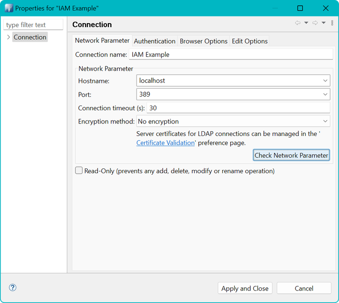
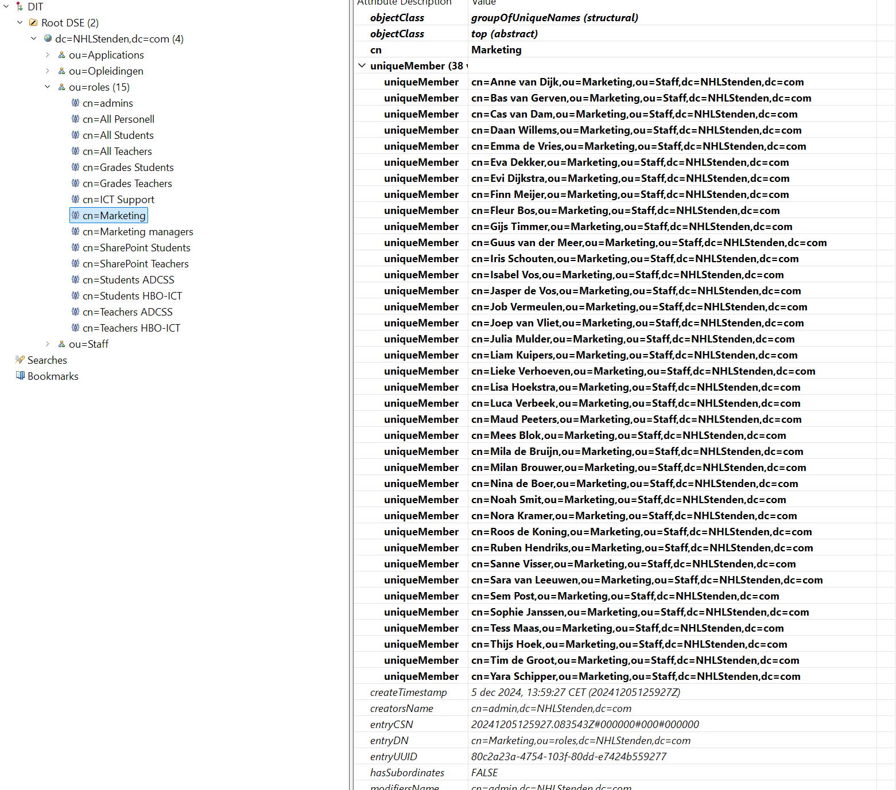

# Welkom

Welkom bij de repository voor de oefeningen rondom het thema Identity & Access Management (IAM).

**Disclaimer**
De code in dit voorbeeld vormt geen goed voorbeeld voor het opzetten van een veilige website! De focus ligt voornamelijk
op het kunnen spelen met autorisaties op basis van een Role Based Access (RBAC) model met gebruik van permissies.

# Installatie en activeren

Hier wordt uitgelegd hoe je deze repository kunt installeren en de software kunt starten om de oefeningen uit te voeren.

## Randvoorwaarden

Om deze oefeningen uit te kunnen voeren heb je de volgende zaken nodig:

* Een werkende Docker installatie
* Toegang tot je `hosts`-file voor het toevoegen van hostnames.
* De applicatie Apache Directory Studio

1. Gebruik een GIT-client of download deze repository als een ZIP file.
2. Als je deze repository op je computer hebt staan ga je naar de map en open je een Command Prompt (bash, cmd,
   Powershell)
3. Bouw en start de container
4. Voeg in je hosts-file de URL's van de website toe

## Ophalen repository

Gebruik je favoriete GIT-client of open een Command Prompt en typ onderstaande commando. De repository wordt dan
aangemaakt
in de map waar je op dat moment staat.

```text
c:\sources > git clone https://github.com/NHLStenden/RBAC-example-websites.git 
```

## Controle bestanden

Let op: veel bestanden worden gebruikt binnen een Linux Docker omgeving (Debian). Tekstbestanden worden daar opgemaakt
met regelovergangen die alleen een Linefeed (ASCII code 10) `LF` gebruiken. Bij het ophalen en uitpakken van de
repository
kan het zijn dat bestanden omgezet worden naar Windows opmaakt met een Carriage Return (ASCII code 13) en LineFeed. Dit
wordt ook wel de CRLF of CR+LF opmaak genoemd.

Als die bestanden tijdens het uitpakken omgezet zijn naar CR+LF, dan werken deze niet meer in Docker. Als het goed is
zou het bestand `.gitattributes` dit moeten voorkomen. Daar staat een instelling in dat bestanden altijd alleen LF
moeten
bevatten voor de regelovergangen.

Fouten die voor kunnen komen zijn onder andere `exit code 127: file not found`.

Eventueel kan GIT ingesteld worden om dit globaal te negeren door onderstaande commando uit te voeren.

```text
git config --global core.autocrlf false
```

In de folder van deze repository staan ook twee programma's die de bestanden kunnen repareren

* Voor Windows: `convert-cr-lf.exe`
* Voor onder WSL: `convert-cr-lf-wsl`

Zie onderaan deze handleiding mocht het nodig zijn om deze programma's aan te passen of te hercompileren.

## Bouw en start de containers

In de eerste stap worden de containers gebouwd. De optie `--no-cache` zorgt er voor dat je eerdere instanties/images
van je containers niet hergebruikt, maar echt helemaal opnieuw begint.

De tweede stap start daadwerkelijk de containers.

```cmd
  c:\> docker compose build --no-cache
  c:\> docker compose up
```

Als de containers eenmaal draaien open je *nog* een command prompt en start je het script om alle accounts en
gerelateerde
informatie te genereren. Dit doe je door een script dat in de container zit te starten.

```cmd
c:\> docker exec -it iam-example-identity-server /bin/bash -c /app/slapd-load-entries.sh
```

Als de containers eenmaal zijn gebouwd, kunnen ze ook eenvoudig beheerd worden via bijvoorbeeld een plug-in in je IDE of
via de Docker Desktop applicatie (niet beschikbaar op Linux).

## Aanpassingen in de hosts file

Voeg onderstaande items toe aan je `hosts` file.

```text
# Docker RBAC Example
127.0.0.1	grades.docker sharepoint.docker admin.docker marketing.docker

```

# Testen van de websites

De volgende websites zijn beschikbaar:

| Beschrijving                                     | URL                       | Rol in Identity Server                                                                                           | 
|--------------------------------------------------|---------------------------|------------------------------------------------------------------------------------------------------------------| 
| De website voor Marketing:                       | http://marketing.docker/  | `cn=marketing,ou=roles,dc=NHLStenden,dc=com`                                                                     |
| De Cijfer Administratie                          | http://grades.docker/     | `cn=Grades Students,ou=roles,dc=NHLStenden,dc=com` of `cn=Blackboard Teachers,ou=roles,dc=NHLStenden,dc=com`     |
| Het Admin panel van de beheerder                 | http://admin.docker/      | `cn=admins,ou=roles,dc=NHLStenden,dc=com`                                                                        |
| Het SharePoint platform voor gedeelde informatie | http://sharepoint.docker/ | `cn=SharePoint Students,ou=roles,dc=NHLStenden,dc=com` of `cn=SharePoint Teachers,ou=roles,dc=NHLStenden,dc=com` |

Je kunt hierbij inloggen met de volgende gebruikers. Het wachtwoord is altijd  `Test1234!`. Je kunt met Apache Directory
Studio
ook kijken in de aangegeven rollen in de Identity Server. De onderstaande gebruikersaccounts zijn willekeurig gekozen
uit
die rollen.

* http://marketing.docker/
    * username : `fbos`
* http://grades.docker/
    * student username : `edeboer`
    * teacher username : `gwillems`
* http://admin.docker/
    * username: `tvisser`
* http://sharepoint.docker/
    * student username : `edeboer`
    * teacher username : `gwillems`

Let op: in Microsoft Edge kan het zijn dat een policy niet langer BasicAuthentication (`basic`) toestaat.
Zie https://answers.microsoft.com/en-us/microsoftedge/forum/all/latest-version-of-edge-no-longer-shows-basic/3601252b-e56b-46c0-a088-0f6084eabe47
en `edge://policy/` (zoek naar AuthSchemes) en check of `basic` daar bij staat. Zo niet, gebruik dan een andere browser
(Brave, Firefox, Chromium, Opera, Vivaldi of Google Chrome).

# Aanpassen van autorisaties

Er zijn nu veel autorisaties toegekend. Deze zijn te wijzigen door gebruik te maken van een programma als Apache
Directory Studio.

# Verbinding maken met de Identity Server (LDAP)

Als je een applicatie hebt geinstalleerd die kan werken met een LDAP-server gebruik dan onderstaande gegevens:

* Connection:
    * Hostname: `localhost`
    * Port: `389`
* Authenticatie
    * Authentication method: `Simple Authentication`
    * Gebruikersnaam / DN: `cn=admin,dc=NHLStenden,dc=com`
    * Wachtwoord: `test12345!`
* Opties:
    * Fetch Operational attributes is optioneel

Hieronder een aantal schermafdrukken over de instellingen voor *Apache Directory Studio*. Gebruik na het opstarten
van Apache Directory Studio het menu `LDAP --> New Connection` om een nieuwe verbinding op te zetten.



Gebruik de button `Check Network Parameter` om te kijken of de server op deze manier te bereiken is.


Gebruik de button `Check Authentication` om te kijken of de gebruikersnaam en wachtwoord correct zijn.


Gebruik daarna `Apply and Close`. Daarna zou in het linkervenster de boomstructuur van de identity server zichtbaar
moeten zijn. Mochten er nog geen items zichtbaar zijn onder `dc=NHLStenden,dc=com`, kijk dan terug bij de installatie en
activeren van de Docker Containers.


## Autorisaties aanpassen

Autorisaties zijn vormgegeven door gebruikers in groepen te verzamelen. Dit zijn LDAP-objecten
genaamd `groupOfUniqueNames`.
Een voorbeeld is hier onder weergegeven.



We zien hier een groep met naam `Marketing` (CN=Marketing). Het totale pad (`Distinguished Name` of `DN`) is
`cn=Marketing,ou=roles,dc=NHLStenden,dc=com`.

Aan de rechtkant zien we de details. Daar is een veld `uniqueMember` dat opengeklapt kan worden. Daar zijn 38 leden te
zien.

Om de details van een gebruiker te zien kan een gebruiker geselecteerd worden en op de F3-toets te drukken. Het is ook
mogelijk zelf de `DN` af te lezen en daar handmatig naar toe te navigeren.

Als we bijvoorbeeld navigeren naar gebruiker naar Isabel Vos, dan krijgen we onderstaande details.


# Uitleg over technische vastlegging van rollen en permissies

- Rollen worden beheerd in een LDAP-server als `groupOfUniqueNames`.
- Elke rol in LDAP heeft een corresponderende entry in de `roles` tabel via het veld `distinguishedName`.
- Dit zorgt ervoor dat de rollen consistent zijn tussen de LDAP-server en de database.

#### Praktische uitleg

- **Rollenbeheer**: Rollen worden centraal beheerd in de LDAP-server. Elke rol in de LDAP-server heeft een unieke naam (
  distinguishedName) die overeenkomt met een record in de `roles` tabel van de database.
- **Permissiebeheer**: Permissies worden beheerd in de database. Elke permissie heeft een unieke code en beschrijving. Alleen een programmeur 
kan nieuwe permissies voorstellen als er nieuwe functionaliteiten geimplementeerd worden.
- **Koppeling van rollen en permissies**: De tabel `role_permissions` koppelt rollen aan permissies. Dit betekent dat je
  kunt specificeren welke permissies aan welke rollen zijn toegewezen.
- **Gebruik van de website**: Studenten kunnen via een website permissies aan rollen koppelen. Dit stelt hen in staat om
  de toegangsrechten te beheren zonder nieuwe permissies te hoeven aanmaken.

# Oefeningen

Hier worden een aantal oefeningen beschreven. 

## Basis - inloggen bij websites.

Het beste startpunt is de *Intranet Pagina*: http://sharepoint.docker. 

# Hercompileren van CR-LF converteren

# Verantwoording testgegevens

In deze repository zijn grote hoeveelheden gebruikers opgenomen om te kunnen testen. De reden voor deze grote aantallen
is om
ook beter de attestation te kunnen demonstreren.

De grote aantallen gebruikers zijn tot stand gekomen door middel van generatieve AI (Chat GPT). Daardoor is geen grip op
de kwaliteit van de namen. Zo zijn er vooral nederlandstalige namen gekozen en is er bijvoorbeeld geen rekening gehouden
met
demografische spreiding op geslacht etc.

# Referenties / bronnen

* [Apache Directory Studio](https://directory.apache.org/studio/)
* [Docker Install](https://docs.docker.com/engine/install/)