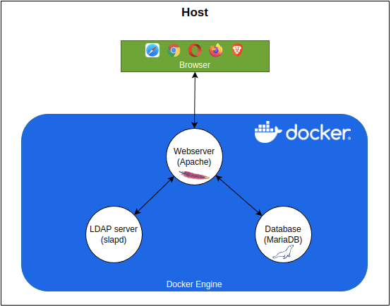

# Verantwoording
Hier volgt een motivatie voor de gekozen architectuur en haar componenten. 

## Architectuur
De architectuur is als volgt opgebouwd:

Op een *host*-systeem (Windows, iOS, Linux) wordt de *Docker Engine* gebruikt om verschillende containers te maken. Elke
container wordt gebruikt om één rol in de architectuur te verzorgen. Er is een webserver gebouwd op Apache. Deze
verzorgt het beschikbaar stellen van een viertal websites. Deze websites gebruiken een LDAP-server als *Identity Store*.
Deze Identity Store verzorgt het veilig opslaan van accounts en gerelateerde informatie. De informatie die de websites
nodig hebben om hun webpagina's op te bouwen wordt beschikbaar gesteld in een database.

Alle gebruikte Docker containers zijn gebaseerd op de Debian Linux distributie.

## Motivatie voor gebruik van Docker

Er is gekozen om de verschillende rollen onder te brengen in verschillende Docker Containers voor de ontwikkelfase. Dit
heeft enkele voordelen die hieronder worden opgesomd. Daarnaast lijkt de configuratie meer op de situatie zoals deze later
ook in een productie situatie zal zijn.

1. **Snellere Iteraties**: Door webserver, database en identity store in afzonderlijke containers te plaatsen, kunnen
   ontwikkelaars snel wijzigingen aanbrengen en testen zonder de hele stack opnieuw te moeten opzetten. Dit versnelt de
   ontwikkelcyclus aanzienlijk.

2. **Consistente Omgevingen**: Containers zorgen ervoor dat elke ontwikkelaar dezelfde omgeving gebruikt, ongeacht hun
   lokale machine. Dit voorkomt problemen die kunnen ontstaan door verschillen in configuraties en afhankelijkheden.

3. **Eenvoudig Debuggen**: Het isoleren van componenten in aparte containers maakt het eenvoudiger om problemen te
   identificeren en op te lossen. Als er een probleem is met de database, kan deze afzonderlijk worden onderzocht zonder
   de webserver of identity store te beïnvloeden.

4. **Flexibiliteit in Technologieën**: Ontwikkelaars kunnen verschillende technologieën en versies uitproberen zonder
   conflicten. Bijvoorbeeld, ze kunnen experimenteren met verschillende versies van een database of webserver zonder de
   andere componenten te verstoren.

5. **Resourcebeheer**: Containers zijn lichtgewicht en efficiënt, wat betekent dat ontwikkelaars meerdere containers
   kunnen draaien op hun lokale machines zonder veel overhead. Dit maakt het mogelijk om een volledige stack te
   simuleren zonder zware systeemvereisten.

Door deze voordelen te benutten, kunnen ontwikkelaars efficiënter en effectiever werken, wat leidt tot snellere en betrouwbaardere softwareontwikkeling. Heb je nog andere vragen of wil je meer details over een specifiek aspect?

# De database

MariaDB is een open-source relationele database, wat betekent dat er geen licentiekosten aan verbonden zijn. Dit maakt
het een kosteneffectieve keuze voor zowel kleine als grote projecten.

Momenteel bevat de database nog geen bedrijfsgegevens. De MariaDB wordt alleen gebruikt voor de opslag van
RBAC-gerelateerde informatie.

Tijdens het bouwen van de Docker container wordt een initialisatie bestand gebruikt om de database aan te maken, 
een `student` gebruiker aan te maken, tabellen, views en stored procedures aan te maken. Daarnaast wordt in aansluiting
op de inrichting van de Identity Store een hoeveelheid data toegevoegd zodat meteen gestart kan worden met een 
werkend RBAC-model met permissies in de broncode van de websites.

# De identity Store

Een **identity store** is een centraal systeem dat informatie over gebruikers en hun toegangsrechten opslaat en beheert.
Het bevat essentiële gegevens zoals gebruikersnamen, wachtwoorden, en toegangsrechten, en speelt een cruciale rol in het
verifiëren van gebruikersidentiteiten binnen een organisatie. Een identity store is niet beperkt tot één enkele
applicatie; het wordt gebruikt door meerdere applicaties binnen een organisatie om consistente en veilige toegang te
bieden. Dit betekent dat wanneer een gebruiker zich aanmeldt bij een applicatie, de identity store de authenticatie en
autorisatie afhandelt, waardoor dezelfde inloggegevens en toegangsrechten kunnen worden gebruikt voor verschillende
systemen. Dit centraliseert het beheer van gebruikersidentiteiten en verhoogt de beveiliging en efficiëntie binnen de
organisatie.

## LDAP

**LDAP** (Lightweight Directory Access Protocol) is een protocol dat wordt gebruikt om toegang te krijgen tot en te
beheren van directory-informatie, zoals die in een identity store. LDAP is efficiënt en schaalbaar, waardoor het
geschikt is voor grote hoeveelheden gebruikersgegevens. Door LDAP te gebruiken in een identity store, kunnen
organisaties eenvoudig en veilig gebruikersauthenticatie en autorisatie beheren.  LDAP maakt het mogelijk om deze
informatie op een gestructureerde en efficiënte manier te beheren en te doorzoeken.

LDAP organiseert gegevens in een hiërarchische structuur, vergelijkbaar met een boom. Deze structuur wordt een
**Directory Information Tree (DIT)** genoemd. Elk item in deze boom wordt een **entry** genoemd en bevat een reeks
attributen (zoals naam, e-mailadres, etc.). Deze attributen zijn sleutel-waarde paren,
bijvoorbeeld `mail: student@example.com`.

LDAP-servers slaan deze gegevens op en bieden een manier om ze te beheren en te doorzoeken. Wanneer een gebruiker
probeert in te loggen op een systeem dat LDAP gebruikt, wordt hun gebruikersnaam en wachtwoord gecontroleerd tegen de
gegevens in de LDAP-directory. Als de gegevens overeenkomen, krijgt de gebruiker toegang.

## Rol van LDAP bij een centrale identity store

LDAP kan een cruciale rol spelen bij het opzetten van een centrale identity store voor meerdere websites. Hier zijn
enkele voordelen:

1. **Gecentraliseerd gebruikersbeheer**: Met LDAP kunnen alle gebruikersgegevens op één centrale locatie worden
   opgeslagen en beheerd. Dit maakt het eenvoudiger om gebruikersaccounts te beheren en te onderhouden.

2. **Single Sign-On (SSO)**: Gebruikers kunnen met één set inloggegevens toegang krijgen tot meerdere websites en
   applicaties. Dit vermindert de noodzaak voor meerdere wachtwoorden en maakt het inloggen eenvoudiger en veiliger.

3. **Toegangscontrole**: LDAP kan worden gebruikt om toegangsrechten en permissies te beheren. Dit betekent dat je kunt
   bepalen welke gebruikers toegang hebben tot welke bronnen op basis van hun rol of andere attributen.

4. **Schaalbaarheid**: LDAP is ontworpen om efficiënt te werken, zelfs met grote hoeveelheden gegevens en veel
   gelijktijdige gebruikers. Dit maakt het geschikt voor gebruik in grote organisaties met veel gebruikers en
   applicaties.

Door LDAP te gebruiken als een centrale identity store, kunnen organisaties een consistente en veilige manier bieden om
gebruikers te authenticeren en te autoriseren over verschillende systemen en applicaties.

## Alternatieven

Natuurlijk zijn er ook alternatieven zoals de Microsoft Active Directory. Hieronder een motivatie waarom gekozen is voor
LDAP.

### Kosten
Een Identity Store gebaseerd op Debian en LDAP is over het algemeen kostenefficiënter dan een Windows Server met Active
Directory. Debian is een gratis open-source besturingssysteem, wat betekent dat er geen licentiekosten zijn. LDAP (
Lightweight Directory Access Protocol) is ook open-source en kan zonder extra kosten worden geïmplementeerd. Windows
Server en Active Directory vereisen daarentegen licenties die jaarlijks vernieuwd moeten worden, wat de kosten
aanzienlijk kan verhogen.

### Eenvoud in Opbouw en Gebruik

Debian en LDAP bieden een eenvoudige en flexibele opzet. Debian is bekend om zijn stabiliteit en veiligheid, en het
configureren van een LDAP-server op Debian is goed gedocumenteerd en ondersteund door een grote gemeenschap. Dit maakt
het eenvoudiger voor studenten en docenten om te leren en te gebruiken. Windows Server en Active Directory kunnen
complexer zijn om op te zetten en te beheren, vooral voor beginners.

### Integratie met Debian/Apache Webserver

Debian werkt naadloos samen met de Apache webserver, wat een veelgebruikte combinatie is in onderwijsomgevingen. LDAP
kan eenvoudig worden geïntegreerd met Apache voor authenticatie en autorisatie, wat een consistente en veilige
gebruikerservaring biedt. Windows Server kan ook worden geïntegreerd met webservers, maar dit vereist vaak extra
configuratie en beheer.

### Tabel met Voor- en Nadelen

| **Aspect**                   | **Debian en LDAP**                                               | **Windows Server en Active Directory**                                      |
|------------------------------|------------------------------------------------------------------|-----------------------------------------------------------------------------|
| **Kosten**                   | Geen licentiekosten, open-source                                 | Licentiekosten, jaarlijkse vernieuwingen                                    |
| **Eenvoud in Opbouw**        | Eenvoudig en goed gedocumenteerd, geschikt voor beginners        | Complexer, vereist meer kennis en ervaring                                  |
| **Gebruik**                  | Flexibel en aanpasbaar, grote gemeenschap voor ondersteuning     | Minder flexibel, afhankelijk van Microsoft ondersteuning                    |
| **Integratie met Webserver** | Naadloze integratie met Debian/Apache, eenvoudig te configureren | Mogelijke extra configuratie nodig, afhankelijk van Microsoft-technologieën |
| **Ondersteuning**            | Grote open-source gemeenschap, veel documentatie en forums       | Officiële ondersteuning van Microsoft, maar kan duur zijn                   |
| **Veiligheid**               | Bekend om stabiliteit en veiligheid, regelmatige updates         | Goede veiligheid, maar afhankelijk van Microsoft updates en patches         |

## Overeenkosten tussen MS AD en LDAP

Microsoft Active Directory (MS AD) en Lightweight Directory Access Protocol (LDAP) hebben verschillende overeenkomsten,
vooral omdat MS AD LDAP als een van de protocollen gebruikt. Hier zijn enkele belangrijke overeenkomsten:

1. **Directory Services**: Beide systemen fungeren als directory services die informatie over gebruikers, groepen, en
   apparaten opslaan en beheren binnen een netwerk.

2. **Authenticatie en Autorisatie**: Zowel MS AD als LDAP worden gebruikt voor het authenticeren van gebruikers en het
   autoriseren van toegang tot netwerkbronnen en applicaties.

3. **Hiërarchische Structuur**: Beide systemen gebruiken een hiërarchische structuur om gegevens te organiseren. In MS
   AD worden deze structuren domeinen, bomen en bossen genoemd, terwijl LDAP gebruik maakt van een Directory Information
   Tree (DIT).

4. **Protocol Ondersteuning**: MS AD ondersteunt het LDAP-protocol, wat betekent dat LDAP-clients kunnen communiceren
   met Active Directory om directory-informatie op te vragen en te beheren.

5. **Toegangsbeheer**: Beide systemen bieden uitgebreide mogelijkheden voor toegangsbeheer, waardoor beheerders
   gedetailleerde controle hebben over wie toegang heeft tot welke resources binnen het netwerk.

# De webserver

Er is gekozen voor *Apache* als webserver. Deze webserver biedt goede integratie met de LDAP-server en is in staat om 
eenvoudig meerdere websites te hosten. 

De webserver wordt geconfigureerd met configuratie bestanden die bij installatie naar de Docker Container worden 
gekopieerd en geactiveerd. Elke configuratie zorgt dat er een eigen integratie is en reageert op een specifieke URL.
Door deze configuratie kan het gebruik van poorten in de URL voorkomen worden. 

Het nadeel is wel dat de gebruiker deze URL's bekend moet maken in de `hosts`-file. Eventueel kan nog gewerkt worden
aan een `reverse proxy` oplossing zoals *Traefik* of *nginx*. Dit brengt echter nogal wat complexiteit met zich mee 
en is voorlopig even buiten scope geplaatst.

# Referenties / bronnen

* [Apache Directory Studio](https://directory.apache.org/studio/)
* [Traefik](https://traefik.io/traefik/)
  * getting started with Traefik as reverse proxy with Docker: [URL](https://doc.traefik.io/traefik/getting-started/quick-start/)

# Colofon

Martin Molema, ing MSc

Docent bij NHL Stenden, opleidingen Bachelor HBO-ICT en Associate Degree Cyber Safety & Security.

[martin.molema@nhlstenden.com](mailto:martin.molema@nhlstenden.com)

December 2024.